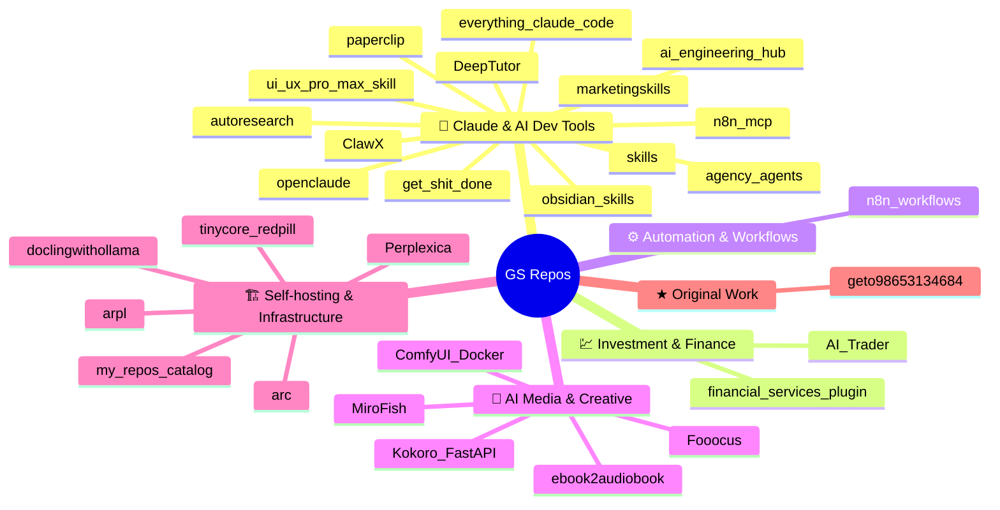

# 🗂️ GS — GitHub Repos Catalog

> Self-taught tech enthusiast · AI tools · Self-hosting · Docker · Open-source

     

---

[🤖 Claude & AI Dev Tools](#claude-ai-dev-tools) · [💹 Investment & Finance](#investment--finance) · [⚙️ Automation & Workflows](#automation--workflows) · [🎨 AI Media & Creative](#ai-media--creative) · [🏗️ Self-hosting & Infrastructure](#self-hosting--infrastructure) · [★ Original Work](#original-work)

---

## 🧭 Landscape

---

<h3>🤖 Claude & AI Dev Tools &nbsp;14 repos</h3>

| Repo | Description | Language | Last Updated | Link |
|------|-------------|----------|--------------|------|
| `openclaude 🍴` | Open Claude Is Open-source coding-agent CLI for OpenAI, Gemini, DeepSeek, Ollama | — | 2026-04-05 | [↗](https://github.com/geto98653134684/openclaude) |
| `skills 🍴` | My personal directory of skills, straight from my .claude directory. | — | 2026-04-01 | [↗](https://github.com/geto98653134684/skills) |
| `DeepTutor 🍴` | "DeepTutor: AI-Powered Personalized Learning Assistant" | — | 2026-03-28 | [↗](https://github.com/geto98653134684/DeepTutor) |
| `get-shit-done 🍴` | A light-weight and powerful meta-prompting, context engineering and spec-driven  | — | 2026-03-21 | [↗](https://github.com/geto98653134684/get-shit-done) |
| `n8n-mcp 🍴` | A MCP for Claude Desktop / Claude Code / Windsurf / Cursor to build n8n workflow | — | 2026-03-20 | [↗](https://github.com/geto98653134684/n8n-mcp) |
| `everything-claude-code 🍴` | The agent harness performance optimization system. Skills, instincts, memory, se | — | 2026-03-15 | [↗](https://github.com/geto98653134684/everything-claude-code) |
| `marketingskills 🍴` | Marketing skills for Claude Code and AI agents. CRO, copywriting, SEO, analytics | — | 2026-03-14 | [↗](https://github.com/geto98653134684/marketingskills) |
| `ai-engineering-hub 🍴` | In-depth tutorials on LLMs, RAGs and real-world AI agent applications. | — | 2026-03-13 | [↗](https://github.com/geto98653134684/ai-engineering-hub) |
| `ClawX 🍴` | ClawX is a desktop app that provides a graphical interface for OpenClaw AI agent | — | 2026-03-13 | [↗](https://github.com/geto98653134684/ClawX) |
| `agency-agents 🍴` | A complete AI agency at your fingertips - From frontend wizards to Reddit commun | — | 2026-03-13 | [↗](https://github.com/geto98653134684/agency-agents) |
| `paperclip 🍴` | Open-source orchestration for zero-human companies | — | 2026-03-12 | [↗](https://github.com/geto98653134684/paperclip) |
| `autoresearch 🍴` | AI agents running research on single-GPU nanochat training automatically | — | 2026-03-11 | [↗](https://github.com/geto98653134684/autoresearch) |
| `ui-ux-pro-max-skill 🍴` | An AI SKILL that provide design intelligence for building professional UI/UX mul | — | 2026-03-10 | [↗](https://github.com/geto98653134684/ui-ux-pro-max-skill) |
| `obsidian-skills 🍴` | Agent skills for Obsidian. Teach your agent to use Markdown, Bases, JSON Canvas, | — | 2026-03-02 | [↗](https://github.com/geto98653134684/obsidian-skills) |

<h3>💹 Investment & Finance &nbsp;2 repos</h3>

| Repo | Description | Language | Last Updated | Link |
|------|-------------|----------|--------------|------|
| `AI-Trader 🍴` | "AI-Trader: Can AI Beat the Market?"  Live Trading Bench: https://ai4trade.ai Te | — | 2026-03-14 | [↗](https://github.com/geto98653134684/AI-Trader) |
| `financial-services-plugins 🍴` | — | — | 2026-03-10 | [↗](https://github.com/geto98653134684/financial-services-plugins) |

<h3>⚙️ Automation & Workflows &nbsp;1 repos</h3>

| Repo | Description | Language | Last Updated | Link |
|------|-------------|----------|--------------|------|
| `n8n-workflows 🍴` | all of the workflows of n8n i could find (also from the site itself) | — | 2025-08-22 | [↗](https://github.com/geto98653134684/n8n-workflows) |

<h3>🎨 AI Media & Creative &nbsp;5 repos</h3>

| Repo | Description | Language | Last Updated | Link |
|------|-------------|----------|--------------|------|
| `MiroFish 🍴` | A Simple and Universal Swarm Intelligence Engine, Predicting Anything. 简洁通用的群体智能 | — | 2026-03-07 | [↗](https://github.com/geto98653134684/MiroFish) |
| `ComfyUI-Docker 🍴` | 🐳Dockerfile for 🎨ComfyUI. | 容器镜像与启动脚本 | — | 2025-01-27 | [↗](https://github.com/geto98653134684/ComfyUI-Docker) |
| `Kokoro-FastAPI 🍴` | Dockerized FastAPI wrapper for Kokoro-82M text-to-speech model w/CPU ONNX and NV | — | 2025-01-21 | [↗](https://github.com/geto98653134684/Kokoro-FastAPI) |
| `Fooocus 🍴` | Focus on prompting and generating | — | 2025-01-14 | [↗](https://github.com/geto98653134684/Fooocus) |
| `ebook2audiobook 🍴` | Convert ebooks to audiobooks with chapters and metadata using dynamic AI models  | — | 2025-01-12 | [↗](https://github.com/geto98653134684/ebook2audiobook) |

<h3>🏗️ Self-hosting & Infrastructure &nbsp;6 repos</h3>

| Repo | Description | Language | Last Updated | Link |
|------|-------------|----------|--------------|------|
| `my-repos-catalog ★` | Auto-generated catalog of all my GitHub repos — categorized, badged, and searcha | — | 2026-04-17 | [↗](https://github.com/geto98653134684/my-repos-catalog) |
| `Perplexica 🍴` | Perplexica is an AI-powered search engine. It is an Open source alternative to P | — | 2025-01-11 | [↗](https://github.com/geto98653134684/Perplexica) |
| `arc 🍴` | Arc is a customized Redpill Loader for DSM 7.x (Xpenology) with enhanced Hardwar | — | 2025-01-08 | [↗](https://github.com/geto98653134684/arc) |
| `doclingwithollama 🍴` | Docling with Ollama - RAG on Local Files with Local Models | — | 2025-01-01 | [↗](https://github.com/geto98653134684/doclingwithollama) |
| `arpl 🍴` | Automated Redpill Loader | — | 2024-05-08 | [↗](https://github.com/geto98653134684/arpl) |
| `tinycore-redpill 🍴` | tinycore-redpill (Syno-install) | — | 2024-04-25 | [↗](https://github.com/geto98653134684/tinycore-redpill) |

<h3>★ Original Work &nbsp;1 repos</h3>

| Repo | Description | Language | Last Updated | Link |
|------|-------------|----------|--------------|------|
| `geto98653134684 ★` | GitHub Profile README | — | 2026-03-01 | [↗](https://github.com/geto98653134684/geto98653134684) |

---

Generated on 2026-04-18 using GitHub Actions + Claude Code · <a href="https://github.com/geto98653134684">@geto98653134684</a>
